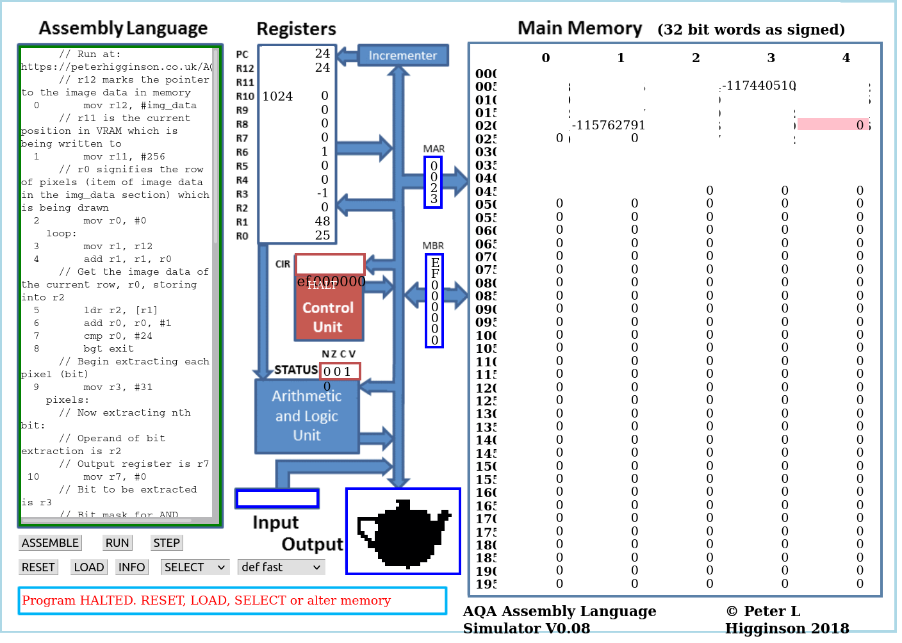

# ARM Assembly: Image Renderer

This is a program which converts image data into a binary form which can then be processed by an ARM32 Assembly program, interpretable via the virtual machine on [Peter Higginson's simulator](http://peterhigginson.co.uk/AQA/).

## Usage
The program can be used either on the command line:
`python image_converter.py [image_file_path].[extension] <output-filename (optional)>`
...or, if no command line argument is supplied:
`python image_converter.py`, the user is prompted for a filepath.
The output of the program is a file output to the `output` directory, whose name can be specified on the command line
or, as with the input image, through user input at runtime.

## Dependencies
The program depends on `PIL` (installation: `pip install Pillow`) to process the images. Furthermore, any user who has the `pyperclip` clipboard module may also benefit from having the program copied directly to the clipboard.

## Gallery
